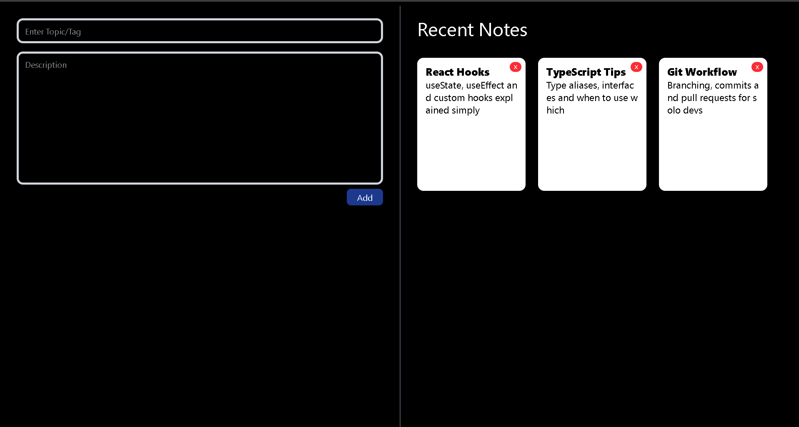
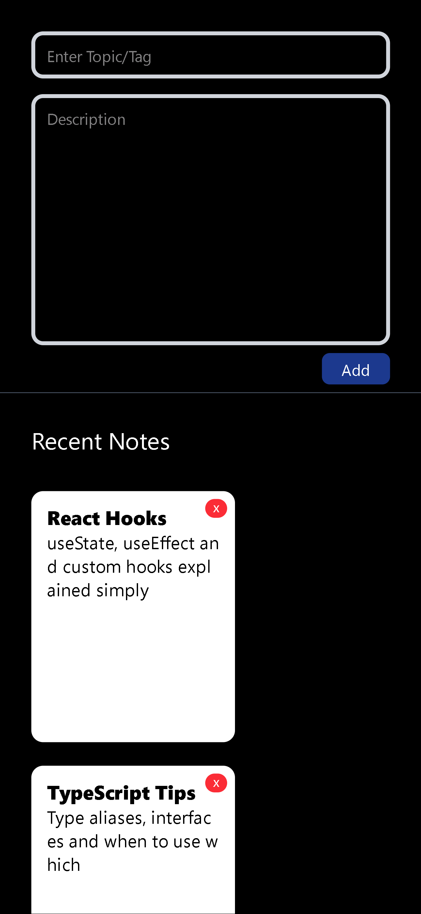

# 📝 Notes App

🔗 [Live Demo](https://notes-app-blue-tau.vercel.app/)

---

## What It Does
A clean notes app where you can add and delete notes with a topic tag and description.
Built with React and TypeScript to practice typed components and state management.

---

## Preview



---



---

## Features
- 📌 Add notes with a topic/tag and description
- ❌ Delete individual notes
- 🗂️ Recent notes displayed as cards

---

## Tech Used
- React · TypeScript · CSS

---

## What I Learned
- Writing React components with TypeScript types and interfaces
- Managing state with useState in React
- Handling form inputs and events in React
- Rendering dynamic lists of components
- Component composition and props

---

## How to Run Locally
```bash
git clone https://github.com/jayant-ssharma/NOTES-APP.git
cd NOTES-APP
npm install
npm run dev
```
